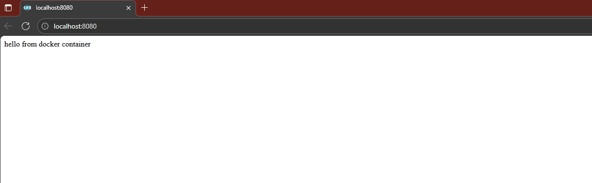
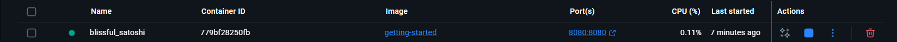
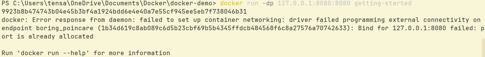

# Containerizing a Spring Boot Application with Docker

## Containerize an application

### Prerequisites

You have installed the latest version of Docker Desktop.
You have installed a Git client.
You have an IDE or a text editor to edit files. Docker recommends using Intellij.

### Get the app

Before you can run the application, you need to get the application source code onto your machine.
Clone the getting-started-app repository using the following command:

Use `git clone https://github.com/AnouarMantich/getting-started-app` to clone the repository.

### Build the app's image

To build the image, you'll need to use a Dockerfile. A Dockerfile is simply a text-based file with no file extension that contains a script of instructions. Docker uses this script to build a container image.

1. In the getting-started-app directory create a file named Dockerfile with the following contents:

```FROM maven:3.9.9-eclipse-temurin-21 AS builder
WORKDIR /app
COPY pom.xml .
RUN mvn dependency:go-offline -B
COPY src ./src
RUN mvn clean package

FROM eclipse-temurin:21-jdk AS runner
WORKDIR /app
COPY --from=builder /app/target/*.jar ./app.jar
EXPOSE 8080
ENTRYPOINT ["java", "-jar", "app.jar"]
```

This Dockerfile builds a Spring Boot application using a multi-stage build.
First, it uses a Maven image to compile and package the project, downloading dependencies and building the JAR file.
Then, it switches to a lightweight JDK runtime image and copies the built JAR from the builder stage.
The container exposes port 8080 and starts the application using java -jar app.jar.
This approach reduces the final image size and improves build efficiency.

2. Build the image using the following commands:

In the terminal, make sure you're in the getting-started-app directory.

`cd /path/to/getting-started-app`

Build the image.

`docker build -t getting-started .`

The docker build command uses this Dockerfile to create a new image using a multi-stage build. First, Docker pulls the maven:3.9.9-eclipse-temurin-21 image and uses it to compile the application and package it into a JAR file. Once the build is complete, the second stage switches to a lighter eclipse-temurin:21-jdk image and copies the generated JAR into a clean runtime environment. The EXPOSE 8080 instruction indicates that the application will run on port 8080, and the ENTRYPOINT command starts the Spring Boot application with java -jar app.jar. Using multi-stage builds keeps the final image small and efficient while separating build dependencies from the runtime environment.

### Start an app container

Now that you have an image, you can run the application in a container using the docker run command.

1. Run your container using the docker run command and specify the name of the image you just created:

`docker run -d -p 127.0.0.1:8080:8080 getting-started`

The -d flag (short for --detach) runs the container in the background. This means that Docker starts your container and returns you to the terminal prompt. Also, it does not display logs in the terminal.

The -p flag (short for --publish) creates a port mapping between the host and the container. The -p flag takes a string value in the format of HOST:CONTAINER, where HOST is the address on the host, and CONTAINER is the port on the container. The command publishes the container's port 8080 to 127.0.0.1:8080 (localhost:8080) on the host. Without the port mapping, you wouldn't be able to access the application from the host.

2 .After a few seconds, open your web browser to http://localhost:8080. You should see your message from the spring app.



At this point, you have a running spring boot app .
If you take a quick look at your containers, you should see at least one container running that's using the getting-started image and on port 8080. To see your containers, you can use the CLI or Docker Desktop's graphical interface.

Run the docker ps command in a terminal to list your containers.

` docker ps`

Output similar to the following should appear.



### Summary

In this section, you learned the basics about creating a Dockerfile to build an image. Once you built an image, you started a container and saw the running app.

### Next step

Next, you're going to make a modification to your app and learn how to update your running application with a new image. Along the way, you'll learn a few other useful commands.

## Update the application

In part 1, you containerized a spring boot application. In this part, you'll update the application and image. You'll also learn how to stop and remove a container.

### Update the source code

1. In the following steps, you'll make some changes to the app , just open the project in intellij and alter the message stored in the varible application.message

2. Build your updated version of the image, using the docker build command.

`docker build -t getting-started .`

3. Start a new container using the updated code.
   `docker run -dp 127.0.0.1:8080:8080 getting-started`

You probably saw an error like this:



The error occurred because you aren't able to start the new container while your old container is still running. The reason is that the old container is already using the host's port 8080 and only one process on the machine (containers included) can listen to a specific port. To fix this, you need to remove the old container.

### Remove the old container

To remove a container, you first need to stop it. Once it has stopped, you can remove it. You can remove the old container using the CLI or Docker Desktop's graphical interface. Choose the option that you're most comfortable with.

Remove a container using the CLI :

1. Get the ID of the container by using the docker ps command.

   `docker ps`

2. Use the docker stop command to stop the container. Replace <the-container-id> with the ID from docker ps.

   `docker stop <the-container-id>`

3. Once the container has stopped, you can remove it by using the docker rm command.

   `docker rm <the-container-id>`

Note

You can stop and remove a container in a single command by adding the force flag to the docker rm command. For example:

        `docker rm -f <the-container-id>`

### Start the updated app container

1. Now, start your updated app using the docker run command.

   `docker run -dp 127.0.0.1:8080:8080 getting-started`

2. Refresh your browser on http://localhost:8080 and you should see your updated help text.

### Summary

In this section, you learned how to update and rebuild an image, as well as how to stop and remove a container.
